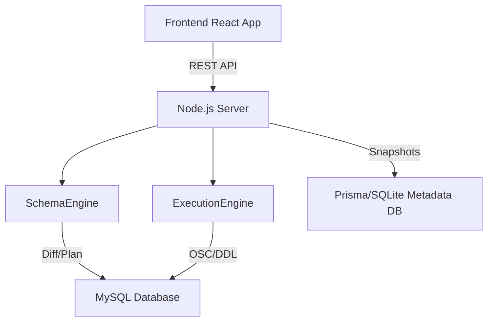

# 🚀 SchemaGit

SchemaGit is a version control system for database schemas. It allows engineers to treat their database evolution like code: **Branch, Diff, Merge, and Apply.**

## ✨ Key Features

- **Branching & Committing:** Create independent branches to evolve your schema without affecting the main database.
- **Semantic Diffing:** Instead of comparing raw SQL, SchemaGit analyzes the structured state of your database to identify exactly what changed.
- **Online Schema Change (OSC):** Designed for production. It uses shadow tables and chunked data copying to apply changes to large tables (~5GB+) without locking the database.
- **Automatic Sync:** Imports and commits are automatically reflected in the live database to keep the environment in sync.
- **Merge Capabilities:** Seamlessly merge evolved schemas from feature branches back into the main line.

## 🛠️ Quick Start

### Prerequisites
- Node.js (v18+)
- MySQL 8.0+

### Setup
1. **Clone the repo:**
   ```bash
   git clone <repo-url>
   cd schemagit
   ```

2. **Start the Backend:**
   ```bash
   cd server
   npm install
   # Configure your .env with your MySQL credentials
   npm run dev
   ```

3. **Start the Frontend:**
   ```bash
   cd client
   npm install
   npm run dev
   ```

4. **Access the App:**
   Open `http://localhost:5173` in your browser.

## 🏗️ Architecture



### How it works:
1. **Import:** A SQL dump is parsed into a structured JSON snapshot.
2. **Version Control:** Snapshots are stored as commits on branches.
3. **Diffing:** The `SchemaEngine` compares two snapshots to find additions, drops, and modifications.
4. **Migration:** The `ExecutionEngine` converts the diff into a migration plan.
5. **Application:** High-risk changes use a shadow-table pattern to avoid locks on large datasets.

## 🚦 Usage Workflow

1. **Import:** Import your current SQL schema to start a project.
2. **Branch:** Create a `feature/new-column` branch.
3. **Commit:** Add your new columns or tables and commit the change.
4. **Diff:** Compare your feature branch against `main` to review changes.
5. **Merge:** Merge the feature branch back into `main`.
6. **Apply:** Push the merged schema to the live MySQL database.
