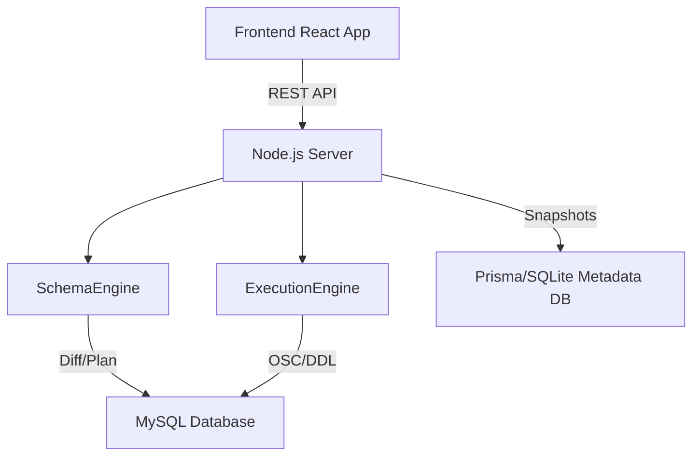

# 🚀 SchemaGit

SchemaGit is a version control system for database schemas. It allows engineers to treat their database evolution like code: **Branch, Diff, Merge, and Apply.**

## ✨ Key Features

- **Branching & Committing:** Create independent branches to evolve your schema without affecting the main database.
- **Semantic Diffing:** Instead of comparing raw SQL, SchemaGit analyzes the structured state of your database to identify exactly what changed.
- **Online Schema Change (OSC):** Designed for production. It uses shadow tables and chunked data copying to apply changes to large tables (~5GB+) without locking the database.
- **Verified Migration Pipeline:** Every schema change follows a strict loop: `Plan` $\rightarrow$ `Execute` $\rightarrow$ `Verify (via INFORMATION_SCHEMA)` $\rightarrow$ `Commit`. This ensures metadata never drifts from the physical DB.
- **Merge Capabilities:** Seamlessly merge evolved schemas from feature branches back into the main line, with a dedicated UI for resolving structural conflicts.

## 🛠️ Quick Start

### Prerequisites
- Node.js (v18+)
- MySQL 8.0+ (or TiDB)
- A MySQL user with permissions to: `CREATE`, `DROP`, `ALTER`, `RENAME` tables, and access to `INFORMATION_SCHEMA`.

### Setup
1. **Clone the repo:**
   ```bash
   git clone <repo-url>
   cd schemagit
   ```

2. **Start the Backend:**
   ```bash
   cd server
   npm install
   # Configure your .env with your MySQL credentials (TIDB_ADMIN_URL)
   npm run dev
   ```

3. **Start the Frontend:**
   ```bash
   cd client
   npm install
   npm run dev
   ```

4. **Access the App:**
   Open `http://localhost:5173` in your browser.

## 🏗️ Architecture

### High-Level Flow


### Solving the 5GB Challenge (Online Schema Change)
To support tables with massive datasets without causing downtime or locking, SchemaGit implements a simplified **OSC (Online Schema Change)** pattern for high-risk operations:

1. **Shadow Table**: Creates a duplicate table (`table_shadow`) with the target schema.
2. **Chunked Copy**: Copies data from the original to the shadow table in small chunks using **Primary Key range scans** (avoiding the performance pitfalls of `OFFSET`).
3. **Atomic Swap**: Uses a single `RENAME TABLE` statement to atomically swap the original table with the shadow table.

### The Verified Migration Pipeline
To eliminate metadata drift, we use a "Verify-before-Commit" loop:
1. **Plan**: Generate a sequence of DDL statements.
2. **Execute**: Apply DDL to the project database.
3. **Verify**: Re-scan the `INFORMATION_SCHEMA` to ensure the actual DB state matches the target snapshot.
4. **Commit**: Only if verification succeeds is a new commit recorded in the metadata store.

## 🚦 Usage Workflow (The Golden Path)
1. **Import**: Import your current SQL schema via a .sql file to initialize your project.
2. **Branch**: Create a `feature/new-column` branch from `main`.
3. **Commit**: Use the UI to modify the schema and commit the change to your feature branch.
4. **Diff**: Compare your feature branch against `main` to review the semantic differences.
5. **Merge**: Merge the feature branch back into `main`. If conflicts arise (e.g., same column modified differently), use the Conflict Resolver UI.
6. **Apply**: Push the merged schema to the live MySQL database.

## ⚠️ Known Limitations
- **SQL Grammar**: The initial importer uses a regex-based parser. Complex MySQL-specific extensions may not be fully captured.
- **Concurrency**: The system currently lacks distributed locking for simultaneous `Apply` requests.
- **Scope**: Support for Stored Procedures and Triggers is omitted to focus on the core table/column versioning engine.
